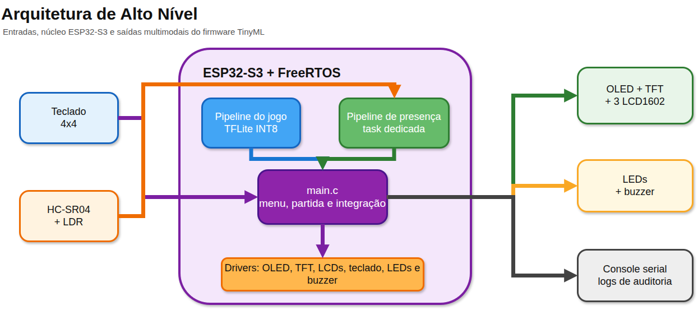
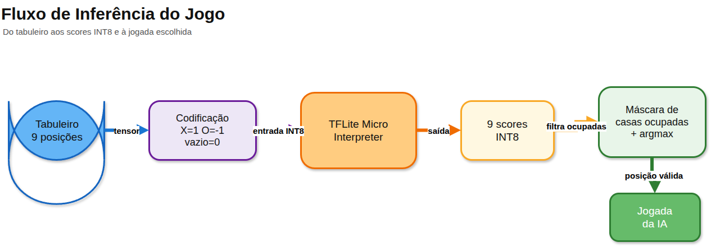
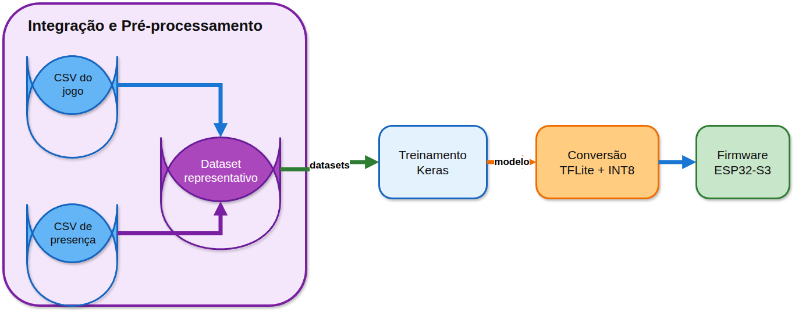
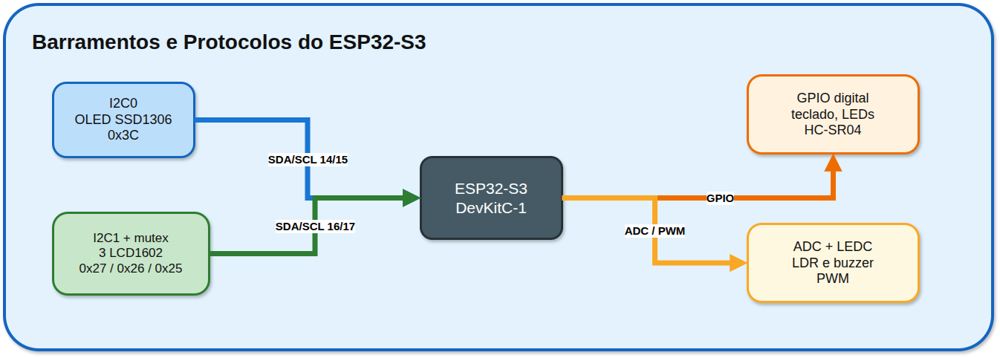
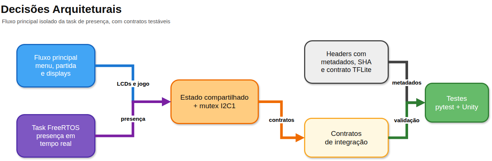
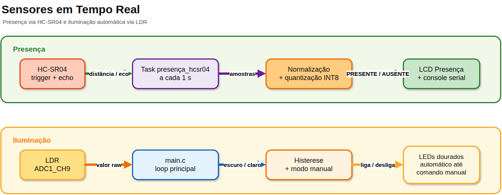
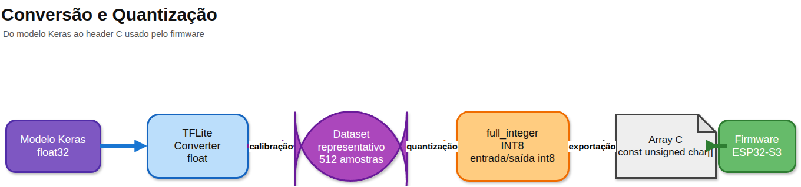
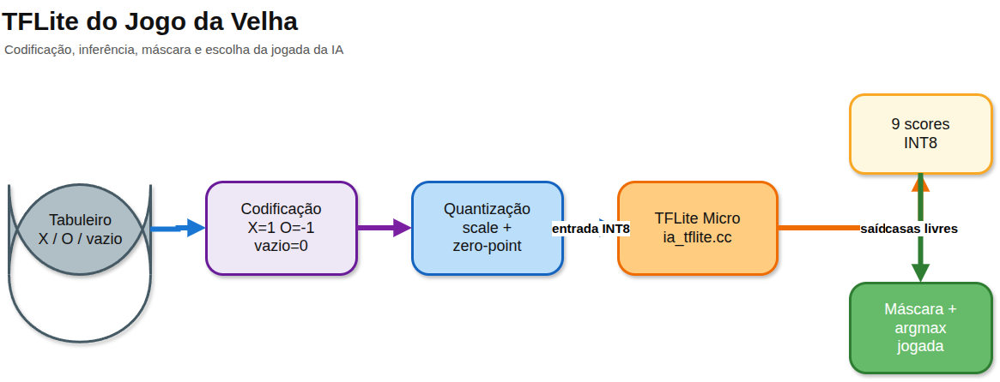
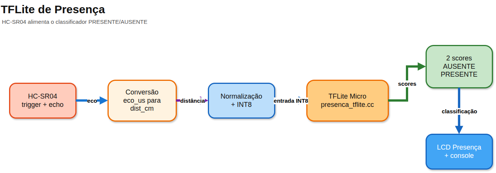

<p align="center">
  
  
  
  
  
</p>

<h1 align="center">🎮 Jogo da Velha com IA Embarcada no ESP32-S3</h1>

<p align="center">
  <strong>Sistema multimodal de Tic-Tac-Toe com inferência TFLite Micro INT8 on-device,<br>
  detecção de presença por ultrassom e iluminação adaptativa —<br>
  tudo rodando localmente em um microcontrolador, sem dependência de nuvem.</strong>
</p>

<p align="center"><em>Autores: Janiel, Joao e Patrik</em></p>

<br>

<p align="center">
  <a href="#-visão-geral">Visão Geral</a> •
  <a href="#-arquitetura">Arquitetura</a> •
  <a href="#-pipeline-de-ia">Pipeline de IA</a> •
  <a href="#-hardware">Hardware</a> •
  <a href="#-firmware">Firmware</a> •
  <a href="#-primeiros-passos">Primeiros Passos</a> •
  <a href="#-resultados">Resultados</a>
</p>

---

## 🧠 Visão Geral

Este projeto implementa um **jogo da velha embarcado no ESP32-S3** em que o jogador humano enfrenta uma inteligência artificial compacta executada inteiramente no microcontrolador via **TensorFlow Lite for Microcontrollers**. Toda a cadeia — coleta de dados, normalização, quantização e inferência — acontece on-device.

Em paralelo, o sistema executa uma **pipeline de detecção de presença** em tempo real: o sensor ultrassônico HC-SR04 alimenta um segundo modelo TFLite INT8, classificando continuamente se há alguém próximo ao dispositivo — tudo isolado em uma task FreeRTOS dedicada. Quando o jogador é detectado como **AUSENTE**, o sistema **bloqueia automaticamente o teclado**, impedindo interações até que a presença seja restaurada.

### ✨ Destaques

<table>
<tr>
<td width="50%">

🤖 **Dois modelos TFLite INT8**
> Jogo (5.7 KB) + Presença (1.3 KB) — quantizados com `full_integer_int8`

🔒 **Interação condicionada por presença**
> Teclado bloqueado quando o jogador está ausente (HC-SR04)

⚡ **Inferência 100% local**
> Edge computing puro — zero chamadas de rede

🔄 **Multitarefa FreeRTOS**
> Task de presença em paralelo ao fluxo do jogo

</td>
<td width="50%">

🖥️ **Interface multimodal**
> OLED 128×64 + ILI9341 TFT 320×240 + 3× LCD1602 + teclado 4×4 + LEDs + buzzer

💡 **Iluminação adaptativa**
> LDR com histerese aciona LEDs dourados automaticamente

🔍 **Auditoria completa**
> Relatórios JSON + audit trail estruturado de partidas com jogadas, resultados e linhas vencedoras

</td>
</tr>
</table>

### 🛠️ Stack Tecnológica

```
Hardware    ESP32-S3 DevKitC-1 · OLED SSD1306 · ILI9341 TFT · 3× LCD1602 · HC-SR04 · LDR · Teclado 4×4
Firmware    ESP-IDF (C/C++) · FreeRTOS · TFLite Micro · I2C · SPI · ADC · LEDC/PWM
ML          Python · Keras/TensorFlow · TFLite Converter · Quantização INT8
Simulação   Wokwi (diagram.json) · VS Code
Testes      pytest (host) · Unity Framework (embarcado)
```

---

## 🏗️ Arquitetura

### Visão de Alto Nível

<p align="center">
  
</p>

<p align="center"><sub>Fonte editável: <a href="docs/diagramas/arquitetura_alto_nivel.drawio">docs/diagramas/arquitetura_alto_nivel.drawio</a></sub></p>

### Fluxo de Dados — Inferência do Jogo

<p align="center">
  
</p>

<p align="center"><sub>Fonte editável: <a href="docs/diagramas/fluxo_inferencia_jogo.drawio">docs/diagramas/fluxo_inferencia_jogo.drawio</a></sub></p>

---

## 🧬 Pipeline de IA

O projeto implementa **duas pipelines TinyML completas**, cada uma seguindo o ciclo:

<p align="center">
  
</p>

<p align="center"><sub>Fonte editável: <a href="docs/diagramas/pipeline_ia.drawio">docs/diagramas/pipeline_ia.drawio</a></sub></p>

### 🎯 Modelo do Jogo da Velha

Recebe o estado do tabuleiro como tensor de 9 posições e retorna scores para cada casa. O firmware aplica máscara nas casas ocupadas e seleciona a melhor posição disponível.

| Especificação | Valor |
| :--- | :--- |
| **Pipeline** | `ml/pipeline_tictactoe.py` |
| **Dataset** | `ml/datasets/dataset_tictactoe.csv` — **2097** amostras |
| **Arquitetura** | `Input(9) → Dense(32, ReLU) → Dense(32, ReLU) → Dense(9)` |
| **Quantização** | `full_integer_int8` · 512 amostras representativas |
| **Tamanho INT8** | **5848 bytes** (5.7 KB) |
| **Acurácia INT8** | 73.27% top-1 · **96.42% jogada ótima** |
| **Arena** | 8192 bytes |

> [!NOTE]
> **Por que 73% de acurácia basta?** No jogo da velha, múltiplas posições podem ser igualmente ótimas. O modelo acerta a *melhor* em 73% — nos outros 27%, seleciona outra jogada que *também é ótima*. A métrica de jogada ótima (**96.42%**) confirma que o modelo quase sempre escolhe dentro do conjunto ideal.

### 📡 Modelo de Presença

Classifica `PRESENTE`/`AUSENTE` com base na distância (cm) e tempo de eco (µs) do HC-SR04. Quando o jogador é classificado como ausente, o sistema bloqueia automaticamente o teclado.

| Especificação | Valor |
| :--- | :--- |
| **Pipeline** | `ml/pipeline_presenca.py` |
| **Dataset** | `ml/datasets/presenca_hcsr04.csv` — **1775** amostras (1435 ausente / 340 presente) |
| **Arquitetura** | `Input(2) → Dense(2)` + classificador compacto calibrado |
| **Faixa PRESENTE** | 2 a 69 cm (≥ 70 cm = AUSENTE) |
| **Tamanho INT8** | **1336 bytes** (1.3 KB) |
| **Acurácia INT8** | **100%** (classificador compacto calibrado no dataset completo) |
| **Arena** | 8192 bytes |

<details>
<summary><strong>📦 Artefatos gerados por cada pipeline</strong></summary>

Cada pipeline produz automaticamente:

| Artefato | Formato | Destino |
| :--- | :--- | :--- |
| Modelo float | `.tflite` | `ml/models/` |
| Modelo INT8 | `.tflite` | `ml/models/` |
| Header C | `.h` (array const) | `main/` |
| Relatório de auditoria | `.json` | `ml/relatorios/` |

Os relatórios registram métricas float e INT8, matrizes de confusão, SHA-256 de cada artefato e contrato de quantização completo.

</details>

---

## 🔌 Hardware

### Componentes

| Componente | Qtd | Função |
| :--- | :---: | :--- |
| ESP32-S3 DevKitC-1 | 1 | Controlador central + inferência TFLite |
| Teclado matricial 4×4 | 1 | Entrada de menu e jogadas |
| OLED SSD1306 128×64 | 1 | Menu, tabuleiro, placar, mensagens |
| ILI9341 TFT 320×240 | 1 | Display gráfico SPI (fonte 8×8 escalada) |
| LCD1602 I2C | 3 | Displays dedicados: IA · Presença · Estatísticas |
| HC-SR04 | 1 | Sensor ultrassônico (pipeline de presença) |
| LDR (fotorresistor) | 1 | Luminosidade → iluminação automática |
| LED azul | 1 | Feedback visual |
| LED verde | 1 | Feedback visual |
| LEDs dourados | 4 | Iluminação decorativa/adaptativa |
| Buzzer | 4 | Feedback sonoro |

### Mapa de Pinos

<details>
<summary><strong>📍 Pinagem completa do ESP32-S3</strong></summary>

| Componente | Sinal | GPIO | Configuração |
| :--- | :--- | :---: | :--- |
| Teclado | R1–R4 | 2–5 | Digital input |
| Teclado | C1–C4 | 6–9 | Digital input |
| LDR | Analógico | 10 | ADC1_CH9 |
| LED azul | OUT | 11 | Digital output |
| LED verde | OUT | 12 | Digital output |
| LEDs dourados | OUT | 13 | Digital output |
| OLED SSD1306 | SDA / SCL | 14 / 15 | I2C0 · 0x3C · 400 kHz |
| LCD IA | SDA / SCL | 16 / 17 | I2C1 · 0x27 · 100 kHz |
| LCD Presença | SDA / SCL | 16 / 17 | I2C1 · 0x26 · 100 kHz |
| LCD Estatísticas | SDA / SCL | 16 / 17 | I2C1 · 0x25 · 100 kHz |
| Buzzer | PWM | 18 | LEDC |
| HC-SR04 | TRIG / ECHO | 19 / 20 | Digital I/O |

> Os três LCDs compartilham I2C1 com endereços distintos. O driver `lcd1602_i2c.c` usa mutex para serializar transmissões concorrentes.

</details>

### Barramentos e Protocolos

<p align="center">
  
</p>

<p align="center"><sub>Fonte editável: <a href="docs/diagramas/barramentos_protocolos.drawio">docs/diagramas/barramentos_protocolos.drawio</a></sub></p>

---

## ⚙️ Firmware

### Organização por Camadas

| Camada | Arquivos | Responsabilidade |
| :--- | :--- | :--- |
| **Aplicação** | `main.c` | Inicialização, menu, partida, presença, estatísticas, auditoria |
| **Regras** | `jogo_da_velha.*` | Tabuleiro, vitória/empate, placar |
| **Auditoria** | `jogo_auditoria.*` | Serialização do tabuleiro, análise de resultado e linha vencedora |
| **Interação** | `jogo_interface.*` | Bloqueio de teclado por presença, formatação de LCD stats |
| **IA Jogo** | `ia_tflite.*` · `ia_jogo_da_velha.*` | Inferência INT8, máscara de ocupadas |
| **IA Presença** | `presenca_tflite.*` | Classificação HC-SR04 → TFLite + compacto calibrado |
| **Sensores** | `hcsr04.*` · `ldr.*` | Distância/eco, luminosidade com histerese |
| **Interface** | `ssd1306_i2c.*` · `lcd1602_i2c.*` · `ili9341_spi.*` · `teclado_matricial.*` | OLED, TFT ILI9341 (SPI), LCDs, teclado |
| **Gráficos** | `fonte_8x8.h` | Fonte bitmap 8×8 para renderização no ILI9341 |
| **Atuadores** | `leds.*` · `buzzer.*` | LEDs e sons |

<details>
<summary><strong>🔬 Estados e estruturas internas</strong></summary>

| Estrutura | Uso |
| :--- | :--- |
| `jogo_estado_t jogo` | Tabuleiro, placar e estado da partida |
| `jogo_auditoria_resultado_t` | Análise de resultado: vitória, empate, linha vencedora |
| `ia_tflite_t modelo_ia` | Runtime TFLite do jogo |
| `presenca_tflite_t modelo_presenca` | Runtime TFLite de presença |
| `presenca_estado_t estado_presenca` | Última leitura HC-SR04, classe e score |
| `jogo_estatisticas_t estatisticas_jogo` | Tempo, jogadas e média |
| `lcd1602_t lcd_ia/presenca/estatisticas` | Três LCDs no barramento compartilhado |
| `ili9341_t` | Display TFT ILI9341 via SPI |
| `SemaphoreHandle_t mutex_estado_presenca` | Proteção thread-safe |

</details>

<details>
<summary><strong>📐 Formato dos dados e memória</strong></summary>

| Dado | Formato | Detalhes |
| :--- | :--- | :--- |
| Tabuleiro | 9 slots (`X`/`O`/vazio) | OLED + entrada do modelo |
| Entrada jogo | Tensor INT8 `[1,9]` | `X=1`, `O=-1`, `∅=0` quantizado |
| Saída jogo | Tensor INT8 `[1,9]` | Score por casa (máscara aplicada) |
| Entrada presença | `[dist_cm, eco_us]` | Normalizado + quantizado |
| Saída presença | Tensor INT8 `[1,2]` | Classe AUSENTE/PRESENTE |

Modelos ficam em flash como `const` arrays. Arenas estáticas:

```c
#define TICTACTOE_MODEL_TENSOR_ARENA_BYTES  8192
#define PRESENCA_MODEL_TENSOR_ARENA_BYTES   8192
```

</details>

---

## 📁 Estrutura do Repositório

```
.
├── main/                            # Firmware ESP-IDF (C/C++)
│   ├── main.c                       #   Ponto de entrada, integração e auditoria
│   ├── ia_tflite.cc/.h              #   Inferência TFLite do jogo
│   ├── presenca_tflite.cc/.h        #   Classificador de presença (TFLite + compacto)
│   ├── jogo_auditoria.c/.h          #   Audit trail: serialização, análise e linha vencedora
│   ├── jogo_interface.c/.h          #   Bloqueio por presença + formatação LCD stats
│   ├── tictactoe_model_data.h       #   Modelo INT8 do jogo (array C)
│   ├── presenca_model_data.h        #   Modelo INT8 de presença (array C)
│   ├── jogo_da_velha.c/.h           #   Regras do tabuleiro
│   ├── hcsr04.c/.h                  #   Driver HC-SR04
│   ├── ldr.c/.h                     #   Driver LDR (histerese + auto-luz)
│   ├── ssd1306_i2c.c/.h             #   Driver OLED
│   ├── ili9341_spi.c/.h             #   Driver TFT ILI9341 (SPI, 320×240)
│   ├── fonte_8x8.h                  #   Fonte bitmap 8×8 para renderização TFT
│   ├── lcd1602_i2c.c/.h             #   Driver LCDs I2C (mutex)
│   ├── teclado_matricial.c/.h       #   Driver teclado 4×4
│   ├── leds.c/.h                    #   Controle de LEDs
│   └── buzzer.c/.h                  #   Controle do buzzer
│
├── ml/                              # Machine Learning
│   ├── pipeline_tictactoe.py        #   Pipeline completa do jogo
│   ├── pipeline_presenca.py         #   Pipeline completa de presença
│   ├── datasets/                    #   CSVs de treinamento
│   ├── models/                      #   Modelos .tflite (float + INT8)
│   └── relatorios/                  #   Relatórios JSON de auditoria
│
├── test/                            # Testes automatizados
│   ├── test_pipeline_*.py           #   Validação das pipelines (pytest)
│   ├── test_diagram_json.py         #   Verificação do circuito Wokwi
│   ├── test_requisitos_sistema.py   #   Rastreabilidade de requisitos
│   ├── test_ia_tflite.c             #   Teste embarcado — IA do jogo
│   ├── test_presenca_tflite.c       #   Teste embarcado — presença
│   ├── test_jogo_interface.c        #   Teste embarcado — interação + presença
│   ├── test_gameplay_alpha0.c       #   Teste embarcado — fidelidade ao Alpha0
│   ├── test_jogo_auditoria.c        #   Teste embarcado — audit trail
│   ├── test_teclado_matricial.c     #   Teste embarcado — mapa do teclado
│   ├── test_formatacao_telas.c      #   Teste embarcado — scroll LCD
│   ├── test_jogo_da_velha.c         #   Teste embarcado — regras
│   ├── test_hcsr04.c                #   Teste embarcado — sensor
│   └── test_ldr.c                   #   Teste embarcado — luminosidade
│
├── codigo-ET/                       # Código legado Alpha0 (referência histórica)
├── logs/                            # Logs de auditoria de partidas
├── docs/                            # Documentação auxiliar
├── diagram.json                     # Esquemático Wokwi
├── wokwi.toml                       # Config do simulador
├── iniciar.sh                       # Script setup/build/test (Linux)
├── iniciar.bat                      # Script setup/build (Windows)
├── requirements.txt                 # Deps Python
├── CMakeLists.txt                   # Build ESP-IDF
└── sdkconfig.defaults               # Config padrão do SDK
```

---

## 🚀 Primeiros Passos

### Pré-requisitos

| Requisito | Versão |
| :--- | :--- |
| ESP-IDF | v5.x+ |
| Python | 3.8+ |
| Extensão Wokwi (VS Code) | Opcional — para simulação |

### Linux — Setup Rápido

```bash
# 1. Clona o repositório
git clone https://github.com/p19091985/IA-Embarcada-e-Modelos-Compactos-Projeto-Final-Validacao.git
cd IA-Embarcada-e-Modelos-Compactos-Projeto-Final-Validacao

# 2. Prepara .venv, instala dependências e valida ESP-IDF
./iniciar.sh setup

# 3. Compila o firmware
./iniciar.sh build

# 4. Executa testes
./iniciar.sh testar       # host (pytest)
./iniciar.sh validar      # artefatos + rastreabilidade
./iniciar.sh unity        # embarcados (Unity)

# 5. Simula no Wokwi
./iniciar.sh simular

# 6. Roda em placa real com auditoria serial
./iniciar.sh auditoria
```

### Windows

```cmd
iniciar.bat setup
iniciar.bat
```

> [!TIP]
> Se o ESP-IDF não estiver no caminho padrão, defina `IDF_PATH` ou `IDF_EXPORT` antes de executar.

### 🎮 Controles

| Tecla | Função | | Tecla | Função |
| :---: | :--- | --- | :---: | :--- |
| `A` | Iniciar partida | | `1`–`9` | Selecionar casa |
| `B` | Exibir placar | | `*` | LED dourado ON (manual) |
| `C` | Encerrar programa | | `#` | LED dourado OFF (manual) |
| `D` | Créditos | | `0` | Zerar placar |

> [!NOTE]
> O jogador usa `O`, a IA usa `X`. O OLED exibe o tabuleiro com `---+---+---` e **todo conteúdo é espelhado no console serial** para acompanhamento remoto.
>
> **Presença obrigatória:** quando o HC-SR04 classifica o jogador como AUSENTE (≥ 70 cm), todas as teclas são ignoradas e o buzzer não emite som. A interação só é liberada quando a presença é restaurada.

---

## 🔁 Re-treinamento dos Modelos

```bash
source .venv/bin/activate

python3 ml/pipeline_tictactoe.py    # jogo da velha
python3 ml/pipeline_presenca.py     # presença

# Modo sem TensorFlow (usa modelos pré-existentes):
python3 ml/pipeline_tictactoe.py --sem-treino
python3 ml/pipeline_presenca.py --sem-treino
```

Cada pipeline executa: **dataset → Keras → TFLite float → quantização INT8 → header C → relatório JSON**.

---

## 🧪 Testes e Validação

### Duas Camadas de Testes

<table>
<tr>
<td width="50%">

**🐍 Host (Python / pytest)**

| Teste | Valida |
| :--- | :--- |
| `test_pipeline_tictactoe` | Dataset, ótima, header, JSON |
| `test_pipeline_presenca` | Dataset, modelo, header, JSON |
| `test_diagram_json` | Componentes e GPIOs Wokwi |
| `test_requisitos_sistema` | Rastreabilidade completa |

</td>
<td width="50%">

**🔧 Embarcado (Unity / C)**

| Teste | Valida |
| :--- | :--- |
| `test_ia_tflite` | Inferência + contrato do jogo |
| `test_presenca_tflite` | Classificador de presença |
| `test_jogo_interface` | Bloqueio por presença + stats LCD |
| `test_gameplay_alpha0` | Fidelidade à mecânica do Alpha0 |
| `test_jogo_auditoria` | Serialização e análise de auditoria |
| `test_teclado_matricial` | Mapa de teclas documentado |
| `test_formatacao_telas` | Scroll de autores no LCD |
| `test_jogo_da_velha` | Regras do tabuleiro |
| `test_hcsr04` | Conversão eco → distância |
| `test_ldr` | Limiares e histerese de luminosidade |

</td>
</tr>
</table>

```bash
./iniciar.sh testar         # pytest (host)
./iniciar.sh validar        # artefatos
./iniciar.sh unity          # Unity (embarcado)
./iniciar.sh flash-testes   # flash em placa real
./iniciar.sh auditoria      # firmware principal + log serial em logs/jogo_auditoria.log
```

### ✅ Checklist de Validação no Wokwi

<details>
<summary><strong>Expandir checklist completo (15 itens)</strong></summary>

- [ ] O OLED exibe o menu principal ao iniciar
- [ ] A tecla `A` inicia uma partida
- [ ] O tabuleiro aparece no OLED com separadores `---+---+---`
- [ ] As teclas `1` a `9` selecionam casas válidas
- [ ] O computador joga usando o modelo TFLite INT8
- [ ] O LCD de IA mostra `TFLite` e os autores em scroll
- [ ] O LCD de presença mostra `PRESENTE`/`AUSENTE`, distância e score
- [ ] O LCD de estatísticas mostra tempo, jogadas e média
- [ ] O HC-SR04 classifica presença continuamente durante o jogo
- [ ] O LDR aciona iluminação automática em ambiente escuro
- [ ] As teclas `*` e `#` controlam o LED dourado
- [ ] A tecla `B` exibe o placar
- [ ] A tecla `D` exibe os créditos
- [ ] O console serial espelha as telas do OLED
- [ ] Vitória, derrota e empate encerram a partida corretamente

</details>

---

## 📊 Resultados

### Métricas Comparativas

<table>
<tr>
<td>

#### 🎯 Modelo do Jogo

| Métrica | Float | INT8 | Δ |
| :--- | ---: | ---: | ---: |
| Acurácia top-1 | 73.27% | 73.27% | 0.00% |
| Jogada ótima | 96.18% | **96.42%** | +0.24% |
| Tamanho | 8.4 KB | **5.7 KB** | −32% |

</td>
<td>

#### 📡 Modelo de Presença

| Métrica | Float | INT8 (compacto) | Δ |
| :--- | ---: | ---: | ---: |
| Acurácia | 98.87% | **100%** | +1.13% |
| Tamanho | 1.1 KB | **1.3 KB** | +18%* |
| Faixa PRESENTE | — | **2–69 cm** | — |

<sub>* Normal em modelos muito pequenos — metadados de quantização pesam proporcionalmente mais.</sub>
<sub>O classificador compacto calibrado atinge 100% de acurácia no dataset completo de 1775 amostras.</sub>

</td>
</tr>
</table>

### Confiabilidade Operacional

<p align="center">
  
</p>

<p align="center"><sub>Fonte editável: <a href="docs/diagramas/decisoes_arquiteturais.drawio">docs/diagramas/decisoes_arquiteturais.drawio</a></sub></p>

### Limitações Conhecidas

> [!WARNING]
> - Validação de consumo elétrico e temporização física depende de teste em hardware real
> - No Wokwi, o sistema é funcional, compilável e rastreável
> - O dataset do jogo usa jogadas geradas por minimax offline — o minimax **não é executado** no firmware
> - A acurácia de 100% do classificador de presença reflete o classificador compacto calibrado; o modelo TFLite real pode apresentar leve variação com dados de campo

---

## 📋 Relatório — Atendimento aos Requisitos do Projeto

Esta seção demonstra, de forma objetiva e rastreável, como o projeto atende plenamente aos quatro requisitos fundamentais exigidos.

### Requisito 1 — Coleta de Dados de Sensores

O sistema utiliza **dois sensores físicos** em operação contínua no ESP32-S3:

| Sensor | Grandeza medida | Interface | Arquivo do driver | Uso no sistema |
| :--- | :--- | :--- | :--- | :--- |
| **HC-SR04** | Distância (cm) + tempo de eco (µs) | GPIO 19/20 (trigger/echo) | `main/hcsr04.c` | Alimenta o classificador de presença TFLite |
| **LDR** | Luminosidade ambiente (ADC raw) | GPIO 10 (ADC1_CH9) | `main/ldr.c` | Aciona iluminação automática via LEDs dourados |

**Como funciona a coleta:**

<p align="center">
  
</p>

<p align="center"><sub>Fonte editável: <a href="docs/diagramas/sensores_tempo_real.drawio">docs/diagramas/sensores_tempo_real.drawio</a></sub></p>

- O HC-SR04 opera em uma **task FreeRTOS dedicada** (`task_presenca_ambiente`), medindo distância e eco a cada 1 segundo — sem interferir no fluxo do jogo
- O LDR é lido no loop principal e aciona iluminação automática com histerese configurável
- Os dados coletados pelo HC-SR04 foram utilizados para gerar o dataset `ml/datasets/presenca_hcsr04.csv` com **1775 amostras** rotuladas
- O dataset do jogo (`ml/datasets/dataset_tictactoe.csv`, **2097 amostras**) foi gerado a partir de simulações completas de estados do tabuleiro com política ótima
- A presença do jogador condiciona o teclado: quando `AUSENTE` (≥ 70 cm), todas as teclas são bloqueadas via `jogo_interface.c`

> [!IMPORTANT]
> **Evidências no repositório:**
> - `main/hcsr04.c` / `main/hcsr04.h` — driver do sensor ultrassônico
> - `main/ldr.c` / `main/ldr.h` — driver do fotorresistor (com histerese e auto-luz)
> - `main/jogo_interface.c` — bloqueio de teclado condicionado por presença
> - `ml/datasets/presenca_hcsr04.csv` — dataset de presença (1775 linhas, 1435 ausente / 340 presente)
> - `ml/datasets/dataset_tictactoe.csv` — dataset do jogo (2097 linhas)
> - `diagram.json` — esquemático Wokwi com HC-SR04 e LDR conectados

---

### Requisito 2 — Treinamento de Modelo com Dataset Próprio

O projeto treina **dois modelos independentes** com datasets próprios, utilizando Keras/TensorFlow:

<table>
<tr>
<td width="50%">

**🎯 Modelo do Jogo da Velha**

| Item | Detalhe |
| :--- | :--- |
| Script | `ml/pipeline_tictactoe.py` |
| Dataset | Próprio — 2097 amostras |
| Geração | Simulação de estados + política ótima |
| Arquitetura | MLP: `9 → 32 → 32 → 9` |
| Loss | Multi-target (todas jogadas ótimas) |
| Épocas | 100 |
| Split | 80/20 (seed=42) |

</td>
<td width="50%">

**📡 Classificador de Presença**

| Item | Detalhe |
| :--- | :--- |
| Script | `ml/pipeline_presenca.py` |
| Dataset | Próprio — 1775 amostras (1435/340) |
| Features | `distancia_cm`, `eco_us` |
| Arquitetura | `Input(2) → Dense(2)` + compacto calibrado |
| Faixa PRESENTE | 2–69 cm (≥ 70 cm = AUSENTE) |
| Classes | AUSENTE (0), PRESENTE (1) |
| Acurácia compacto | **100%** no dataset completo |

</td>
</tr>
</table>

Ambos os treinamentos são **reproduzíveis** com semente fixa (`seed=42`) e geram relatórios JSON completos em `ml/relatorios/` com:

- Métricas de acurácia (float e INT8)
- Matrizes de confusão
- Hashes SHA-256 de todos os artefatos
- Contrato de quantização (shapes, dtypes, scales, zero-points)

> [!IMPORTANT]
> **Evidências no repositório:**
> - `ml/pipeline_tictactoe.py` — pipeline completa do jogo
> - `ml/pipeline_presenca.py` — pipeline completa de presença
> - `ml/relatorios/tictactoe_training_report.json` — relatório com métricas e SHA-256
> - `ml/relatorios/presenca_training_report.json` — relatório com métricas e SHA-256

---

### Requisito 3 — Conversão e Compressão do Modelo

Ambos os modelos passam por um pipeline de **conversão e compressão** antes de serem embarcados:

<p align="center">
  
</p>

<p align="center"><sub>Fonte editável: <a href="docs/diagramas/pipeline_quantizacao.drawio">docs/diagramas/pipeline_quantizacao.drawio</a></sub></p>

| Modelo | Float | INT8 | Redução | Quantização |
| :--- | ---: | ---: | ---: | :--- |
| Jogo da velha | 8592 bytes (8.4 KB) | **5848 bytes (5.7 KB)** | **−32%** | `full_integer_int8` |
| Presença | 1124 bytes (1.1 KB) | **1336 bytes (1.3 KB)** | +18%* | `full_integer_int8` |


<sub>* Modelos ultrapequenos podem ter leve aumento pós-quantização devido ao overhead de metadados INT8.</sub>

**Detalhes da quantização:**

- Tipo: **full integer INT8** — entrada e saída `int8`, sem operações float no runtime
- Dataset representativo: **512 amostras** extraídas do dataset de treino
- Contrato verificado: shapes, dtypes, scales e zero-points documentados no JSON de cada modelo
- Integridade: cada artefato (`.tflite` e `.h`) tem **hash SHA-256** registrado no relatório

> [!IMPORTANT]
> **Evidências no repositório:**
> - `ml/models/tictactoe_float.tflite` — modelo float do jogo (8592 bytes)
> - `ml/models/tictactoe_int8.tflite` — modelo INT8 do jogo (5848 bytes)
> - `ml/models/presenca_float.tflite` — modelo float de presença (1124 bytes)
> - `ml/models/presenca_int8.tflite` — modelo INT8 de presença (1336 bytes)
> - `main/tictactoe_model_data.h` — array C embarcado no firmware (jogo)
> - `main/presenca_model_data.h` — array C embarcado no firmware (presença)

---

### Requisito 4 — Pipeline de Inferência no Dispositivo

O ESP32-S3 executa **duas pipelines de inferência completas** localmente, desde a leitura do sensor até a decisão final:

#### Pipeline de Inferência do Jogo

<p align="center">
  
</p>

<p align="center"><sub>Fonte editável: <a href="docs/diagramas/fluxo_tflite_jogo.drawio">docs/diagramas/fluxo_tflite_jogo.drawio</a></sub></p>

1. O tabuleiro é lido da estrutura `jogo_estado_t` em `main.c`
2. Cada posição é codificada: `X → 1`, `O → −1`, vazio → `0`
3. Os valores são quantizados para INT8 usando o scale/zero-point do contrato TFLite
4. O interpreter TFLite Micro executa a inferência em `ia_tflite.cc`
5. A saída (9 scores) recebe máscara: posições já ocupadas são invalidadas
6. O `argmax` sobre posições válidas determina a jogada do computador

#### Pipeline de Inferência de Presença

<p align="center">
  
</p>

<p align="center"><sub>Fonte editável: <a href="docs/diagramas/fluxo_tflite_presenca.drawio">docs/diagramas/fluxo_tflite_presenca.drawio</a></sub></p>

1. O HC-SR04 é acionado pela task FreeRTOS `presenca_hcsr04` a cada 1 segundo
2. O tempo de eco é convertido em distância (cm) pelo driver `hcsr04.c`
3. `distancia_cm` e `eco_us` são normalizados e quantizados para INT8
4. O interpreter TFLite Micro executa a classificação em `presenca_tflite.cc`
5. A saída indica `PRESENTE` (classe 1) ou `AUSENTE` (classe 0) com score de confiança
6. O resultado é exibido no LCD dedicado e registrado no console serial

> [!IMPORTANT]
> **Evidências no repositório:**
> - `main/ia_tflite.cc` / `main/ia_tflite.h` — inferência TFLite do jogo com máscara
> - `main/presenca_tflite.cc` / `main/presenca_tflite.h` — inferência TFLite de presença
> - `main/main.c` — integração completa: sensores → modelos → displays
> - `test/test_ia_tflite.c` — teste embarcado validando contrato e inferência do jogo
> - `test/test_presenca_tflite.c` — teste embarcado validando classificador de presença

---

### Resumo de Rastreabilidade

| Requisito | Status | Pipelines | Arquivos-chave |
| :--- | :---: | :--- | :--- |
| **1. Coleta de sensores** | ✅ | HC-SR04 (presença) · LDR (luz) | `hcsr04.c` · `ldr.c` · `jogo_interface.c` · `datasets/*.csv` |
| **2. Treinamento com dataset próprio** | ✅ | Jogo (2097 amostras) · Presença (1775 amostras) | `pipeline_tictactoe.py` · `pipeline_presenca.py` |
| **3. Conversão e compressão** | ✅ | TFLite float → INT8 full integer | `models/*.tflite` · `*_model_data.h` |
| **4. Pipeline de inferência on-device** | ✅ | Jogo (máscara + argmax) · Presença (bloqueio + classificação) | `ia_tflite.cc` · `presenca_tflite.cc` · `jogo_interface.c` |

---

## 📄 Licença

Distribuído sob a licença **MIT**. Veja [`LICENSE`](LICENSE) para mais informações.

---

<p align="center">
  <sub>Desenvolvido  por <strong>Janiel, Joao e Patrik</strong></sub><br>
  <sub>ESP32-S3 · TFLite Micro · FreeRTOS · Edge AI</sub>
</p>
